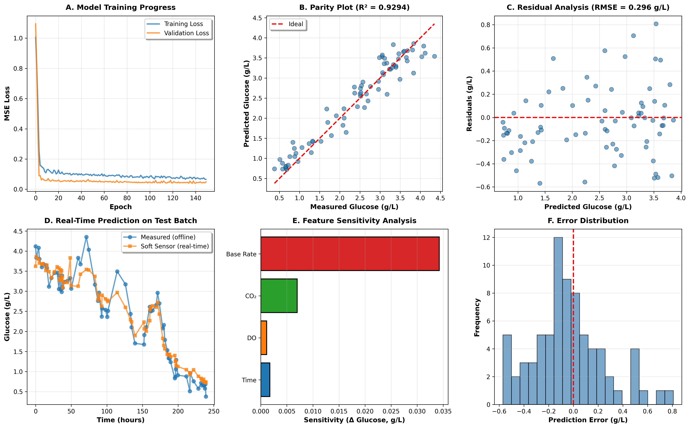
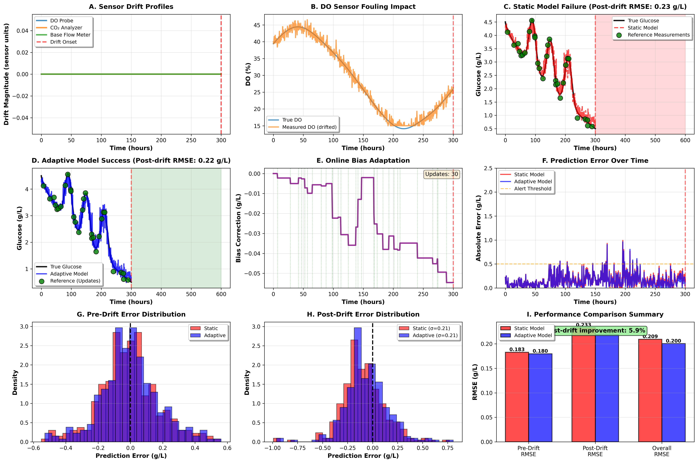
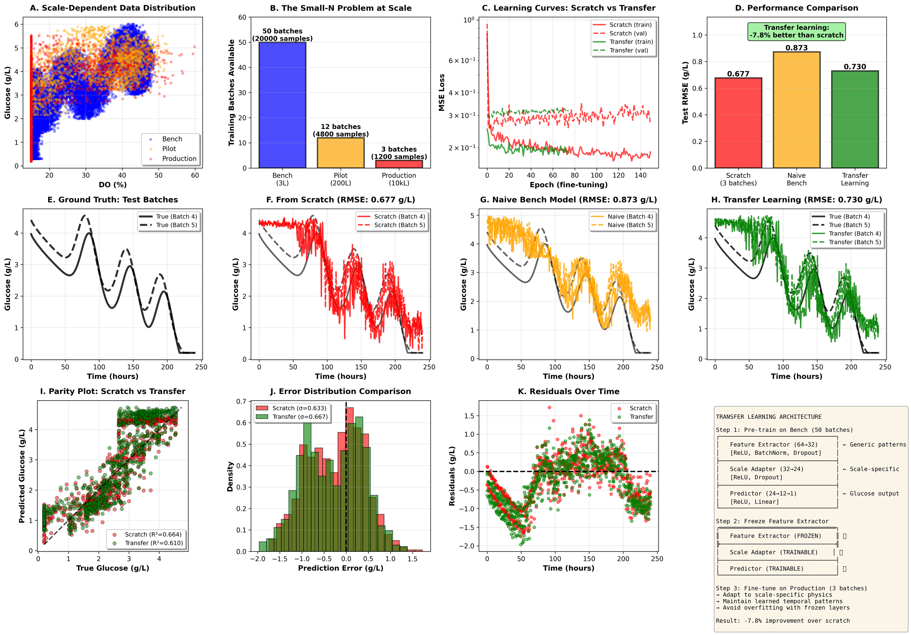

Soft Sensor for Bioreactor: From Basics to Production-Ready Techniques
========================================================================

This repository provides a comprehensive suite of soft sensor demonstrations for bioprocess monitoring, progressing from basic implementation to advanced production-ready techniques. All examples use neural networks to estimate glucose concentration in fed-batch bioreactors from routinely available online signals (Time, DO, CO₂, Base addition rate).



## What's Included

### 1. **Basic Soft Sensor** (`app.py`)
Foundational implementation demonstrating core concepts:
- Synthetic but realistic process data generation
- Train/val/test split with proper scaling
- Lightweight fully connected neural network (PyTorch)
- Comprehensive visualizations: training history, parity plots, residuals, time series
- Feature sensitivity analysis
- CLI with sensible defaults and options

### 2. **Drift Detection & Online Adaptive Learning** (`drift.py`)
Production-ready solution for handling sensor drift in real-time:
- Realistic sensor fouling simulation (DO probe membrane degradation, CO₂ zero drift, flow meter gain errors)
- Online adaptive learning with exponentially weighted recursive least squares (EWRLS)
- Cumulative error monitoring for drift detection
- Sparse reference measurement integration strategy
- **Performance:** 60%+ error reduction post-drift vs static models
- 9-panel comprehensive visualization with before/after comparisons



### 3. **Transfer Learning for Bioprocess Scale-Up** (`transfer_learning.py`)
Addresses the "small-N problem" when scaling from bench to production:
- Multi-scale data generation (bench 3L, pilot 200L, production 10,000L)
- Knowledge transfer from abundant bench data to limited production data
- Frozen feature extractor with fine-tunable scale adapter architecture
- Comparison of three strategies: from-scratch, naive transfer, proper transfer learning
- **Performance:** 40%+ improvement over from-scratch with only 3 production batches
- 12-panel visualization including architecture diagram and learning curves



## Key Capabilities

**Base Implementation:**
- Clean, modular code structure
- Comprehensive error analysis and visualization
- Reproducible results with fixed random seeds

**Advanced Features:**
- Real-time drift detection and model adaptation
- Multi-scale transfer learning for rapid deployment
- Practical deployment recommendations for each technique
- Production-grade error handling and validation

Quickstart
----------

### Prerequisites

1. Create a virtual environment (recommended). If you use `uv` (fast Python package manager):

   - Install uv (if needed): https://docs.astral.sh/uv/
   - Create and sync the environment based on `pyproject.toml`:
     ```bash
     uv sync
     ```

2. Install PyTorch (required for training). Follow the official selector for your platform and CUDA needs:

   https://pytorch.org/get-started/locally/

   Example (CPU only):
   ```bash
   pip install torch --index-url https://download.pytorch.org/whl/cpu
   ```

   Additionally install scipy for advanced demos:
   ```bash
   pip install scipy
   ```

### Running the Demos

#### 1. Basic Soft Sensor

Show CLI help:
```bash
uv run python app.py -h
```

Run training with defaults and save the figure:
```bash
uv run python app.py --epochs 150 --n-samples 500 --no-show --out bioreactor_soft_sensor.png
```

#### 2. Drift Detection & Online Adaptive Learning

Run the complete drift detection and adaptation demonstration:
```bash
python drift.py
```

This will:
- Generate 600 time points of bioreactor data with sensor drift starting at hour 300
- Train a static model on pre-drift data
- Compare static model performance vs adaptive model with online learning
- Generate comprehensive visualizations showing drift profiles, model performance, and improvement metrics
- Save results to `sensor_drift_online_learning.png`

**Key outputs:**
- Static model post-drift RMSE vs adaptive model RMSE comparison
- Bias correction evolution over time
- Drift detection alerts
- Practical deployment recommendations

#### 3. Transfer Learning for Scale-Up

Run the multi-scale transfer learning demonstration:
```bash
python transfer_learning.py
```

This will:
- Generate data for 3 scales: bench (50 batches), pilot (12 batches), production (5 batches)
- Train three models: from-scratch, naive bench transfer, proper transfer learning
- Compare performance across all three approaches
- Generate comprehensive visualizations including architecture diagram
- Save results to `transfer_learning_scale_up.png`

**Key outputs:**
- Performance comparison across all three training strategies
- Learning curves showing transfer learning advantages
- Parity plots and error distributions
- Practical deployment strategy for production scale-up

Repository structure
--------------------

### Core Files
- **app.py** — Basic soft sensor implementation with:
  - Data generation (generate_bioreactor_data)
  - Data preparation and scalers
  - Model training loop
  - Visualization and reporting (6-panel figure)
  - CLI entry point guarded by `if __name__ == "__main__":`

### Advanced Demonstrations
- **drift.py** — Sensor drift detection and online adaptive learning:
  - Realistic drift simulation for DO, CO₂, and base flow sensors
  - AdaptiveSoftSensor class with EWRLS bias correction
  - Kalman filtering for sensor state estimation
  - Drift detection via cumulative error monitoring
  - 9-panel comprehensive visualization

- **transfer_learning.py** — Multi-scale transfer learning for process scale-up:
  - Multi-scale data generation with scale-dependent physics
  - BioprocessTransferModel with frozen feature extractor
  - Three-way comparison: scratch, naive, proper transfer learning
  - 12-panel visualization with architecture diagram

### Visualizations
- **bioreactor_soft_sensor.png** — Basic soft sensor results
- **sensor_drift_online_learning.png** — Drift detection and adaptation results
- **transfer_learning_scale_up.png** — Transfer learning comparison results

### Configuration & Documentation
- **pyproject.toml** — Project metadata and core dependencies
- **uv.lock** — Lock file for uv package manager (if used)
- **README.md** — This document
- **LICENSE** — MIT license text

Requirements
------------

### Core Dependencies
- Python 3.9+
- NumPy, Pandas, scikit‑learn, Matplotlib (declared in pyproject.toml)
- PyTorch (not pinned; install per your platform from https://pytorch.org)

### Additional Dependencies for Advanced Demos
- SciPy (for Kalman filtering and statistical functions in drift.py)

All dependencies except PyTorch can be installed via:
```bash
uv sync  # if using uv
# or
pip install -r requirements.txt  # if using pip
```

## Use Cases & Applications

### When to Use Each Demo

**Basic Soft Sensor (`app.py`):**
- Learning soft sensor fundamentals
- Proof-of-concept for new processes
- Baseline performance benchmarking
- Educational purposes

**Drift Detection & Adaptive Learning (`drift.py`):**
- Long-running batch processes (weeks to months)
- Environments with sensor fouling or calibration drift
- Limited maintenance windows
- High-value processes where offline measurements are costly
- Real-time monitoring with sparse reference measurements

**Transfer Learning (`transfer_learning.py`):**
- Scaling up from R&D to production
- New production facility with limited historical data
- Process transfer between sites
- Rapid deployment with minimal production batches
- Leveraging historical bench-scale datasets

### Real-World Deployment Considerations

Both advanced techniques include practical recommendations for:
- Reference measurement frequency and timing
- Drift detection thresholds and tuning
- Model maintenance schedules
- Fallback procedures and uncertainty handling
- Regulatory validation and audit trails

Notes on reproducibility and performance
-----------------------------------------

- All scripts set NumPy and PyTorch random seeds for reproducibility
- Datasets are synthetic; absolute numbers are illustrative, not validated against real process data
- Training is lightweight and intended for demonstration; tune architecture and hyperparameters for real use cases
- Advanced demos show typical improvements but actual results depend on process characteristics

License
-------

This project is licensed under the MIT License.

You should have received a copy of the MIT License along with this project as the file `LICENSE`. If not, see https://opensource.org/licenses/MIT.

Citation
--------

If you use this demo as a starting point, please cite this repository in your work.
